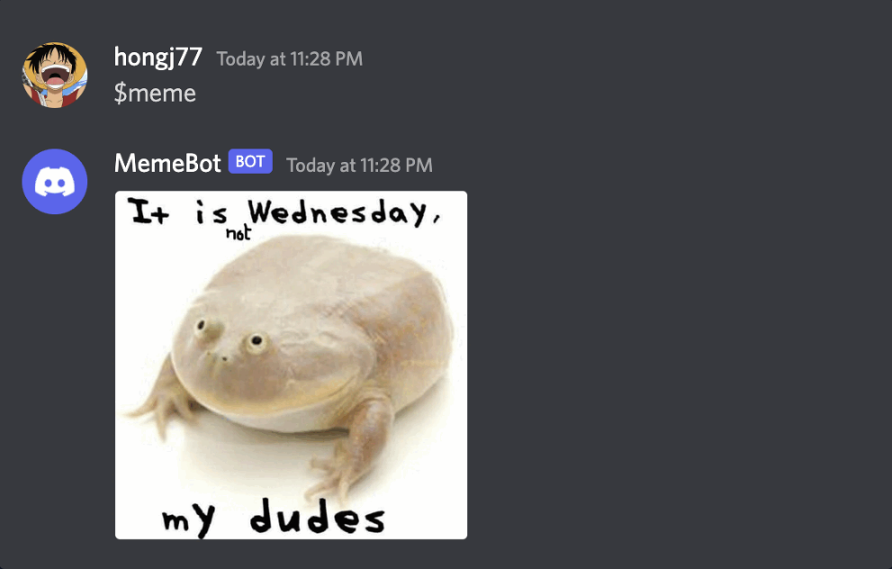
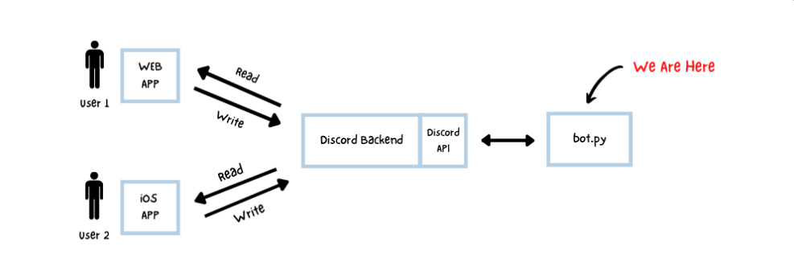

# Discord-MemeBot



## Requirements
Before we get started, you will need a few things if you don't have them already:

1. Python 3 installed.
2. pip (package installer) installed.
3. A Discord account.
4. A Discord server with "Manager Server" permissions.

### 1. Install Dependencies  
Before running the bot, ensure you have Python installed (preferably **Python 3.8+**). Then, install the required dependencies:  

```sh
python3 -m pip install -r requirements.txt
```

If you don’t have a `requirements.txt` file, create one and add the following content:  

```
discord
requests
python-dotenv
```

---

### 2. Get Your Discord Bot Token  
To run your bot, you need a **Discord Bot Token**. You can obtain one by following these steps:  

- Go to the [Discord Developer Portal](https://discord.com/developers/applications)  
- Click **"New Application"**  
- Navigate to **"Bot"** → **"Add Bot"**  
- Click **"Reset Token"** to generate a new token  
- Copy the token and **DO NOT share it with anyone**  

---


### 3. Create a `.env` File  
To keep your bot token secure, store it in a `.env` file instead of hardcoding it.  

1. In the bot's main directory, create a file named `.env`  
2. Open the file and add the following content:  

```
DISCORD_TOKEN=your_bot_token_here
```

**Example (`.env` file):**  
```
DISCORD_TOKEN=your_bot_token_here
```

---

### 4. Run Your Bot  
Once everything is set up, start your bot with:  

```sh
python3 bot.py
```
---

### Additional Notes  
- If your bot isn’t responding to **slash commands**, re-add it to your server with the correct permissions via the [OAuth2 URL Generator](https://discord.com/developers/applications).  

Your bot should now be up and running! 

## How Does a Discord Bot Work?


## Contributing
Feel free to submit issues or pull requests.

## License
This project is licensed under the MIT License.
